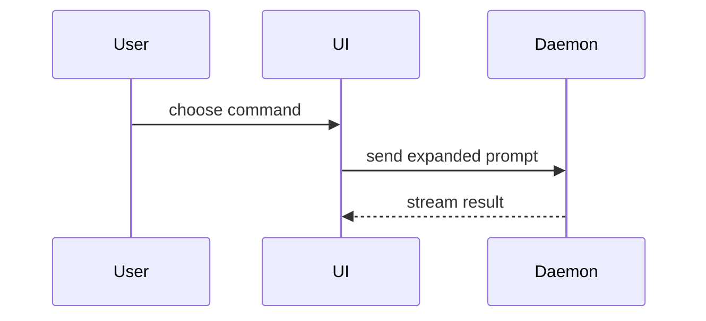

# Viz Inline Skill

Explain the current topic visually, in chat, with the smallest shape that
makes the point clear. Skip the preamble; keep prose brief. No files, no
browser — that is viz-render's job.

Adapted from HumanLayer's show-me skill (MIT,
https://github.com/humanlayer/skills).

## Shapes

Pick one (rarely more) — the smallest that answers the current question.

**Logic / algorithm → pseudocode**

```text
on(save)
  if content is unchanged
    return cached result
  write new content
  return fresh result
```

**Runtime control flow → call tree**

```text
submitForm
  createSession
    persistPrompt
    launchAgent
  navigateToSession
```

**UI structure → component tree** (keep only the state hooks and module
boundaries that matter)

```tsx
<SessionPage> (src/routes/session.tsx)
  useSessionEvents()
  <SessionToolbar>
    <RunSkillButton> (packages/ui)
```

**File responsibility / refactor scope → shallow file tree** (one line of
responsibility per entry)

```text
src/
├── commands/       # parses user actions
├── sessions/       # owns session state
└── transport/      # sends API requests
```

**A change to an existing shape → diff syntax** (when most of the shape is
unchanged, show only what moves; works on any shape above)

```diff
 submitForm
   createSession
     persistPrompt
+    expandSkillMention
   navigateToSession
+    subscribeToEvents
```

```diff
 on(save)
-  write content
+  if content is unchanged
+    return cached result
+  write new content
```

**Code shape before code exists → types and signatures**

```ts
function expandSkill(command: string): string
```

**Component interaction / data flow → small Mermaid** (2–8 nodes; if it
needs more, it belongs in viz-render)



## Rules

- Place each visual next to the short text it supports.
- Keep only the calls, files, props, states, and boundaries needed to answer
  the user's current question — trim everything else.
- Show a whole block only when most of it is new or the user needs a
  copyable target shape.

## Hand-off to viz-render

Escalate to the viz-render skill instead when the output is:

- a document or comparison the user will read as a whole (>~50 lines)
- a table with 4+ rows or 3+ columns
- a Mermaid diagram too dense to read in a fence (>~8 nodes)
- something the user will iterate on (recipe round-trip editing)
